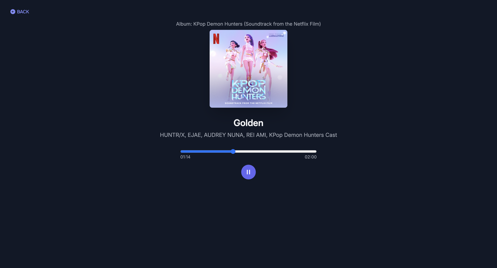

# melowave

A music web app built with React, Vite, and TailwindCSS. It integrates with the Spotify API so users can log in, search for tracks, view track details, and control playback directly in the browser.

This app is live at [melowave.vercel.app](https://melowave.vercel.app/)

## Features

-   Spotify OAuth with PKCE flow
-   Search for tracks
-   View track details
-   Play tracks with playback controls

## Setup

1. Clone this repository:
    ```bash
    git clone https://github.com/jxne00/melowave.git
    ```
2. Install dependencies:
    ```bash
    npm install
    ```
3. Create .env file with Spotify credentials:

    ```bash
    VITE_SPOTIFY_CLIENT_ID=your_client_id
    VITE_SPOTIFY_REDIRECT_URI=your_redirect_uri
    ```

4. Run locally
    ```bash
    npm run dev
    ```

## Demo

### Login


### Search for tracks


### Now Playing

